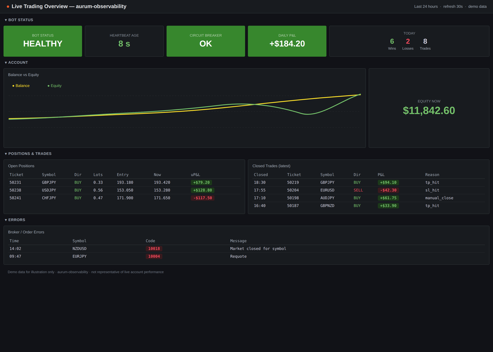

# Aurum Observability

Public observability stack for MT5 FX live trading telemetry, historical backtest analytics, Grafana dashboards, and private artifact access.

This repository owns the public infrastructure and dashboard contract. The private `mt5_fx` repository owns MetaTrader 5 integration, live bot execution, backtests, benchmarks, and data publishers.

## Repository Scope

`aurum-observability` provides the infrastructure, schemas, dashboards, and gateway application needed to operate the observability stack. Runtime configuration is supplied through environment variables.

## Planned Stack

- `uv` for Python tooling.
- Postgres as the Grafana query source of truth.
- SQL-first Alembic migrations for schema versioning.
- Grafana provisioning for dashboards and datasources.
- SeaweedFS using its S3-compatible API for private artifact storage.
- FastAPI artifact gateway for authenticated read-only artifact access.
- Docker Compose for local development only.
- Dokku for production deployment.

## Project Layout

The repository starts with shared project metadata and documentation. Service-specific directories are added as the Postgres, Grafana, SeaweedFS, artifact gateway, scripts, and deployment components land.

## Development

Install dependencies with `uv`:

```bash
uv sync
```

Copy the example environment for local development:

```bash
cp .env.example .env
```

Run database migrations with Alembic:

```bash
uv run alembic -c postgres/alembic.ini upgrade head
```

Do not commit `.env` or any generated runtime artifacts.

## Local Compose Stack

The Compose stack is for local development only. It is not the production deployment path.

Start Postgres, run migrations, start SeaweedFS S3, and start Grafana:

```bash
docker compose -f compose.dev.yaml --env-file .env up
```

Grafana is available at `http://localhost:3000` by default. The provisioned Postgres datasource uses the local Compose database and the `aurum-postgres` datasource UID.

Live trading dashboard direction:



Run migrations as a one-shot service without starting Grafana:

```bash
docker compose -f compose.dev.yaml --env-file .env run --rm migrate
```

Stop the local stack:

```bash
docker compose -f compose.dev.yaml --env-file .env down
```
